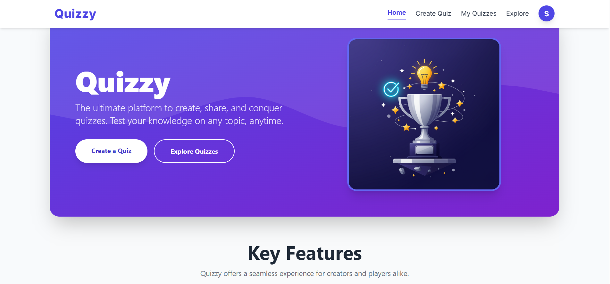
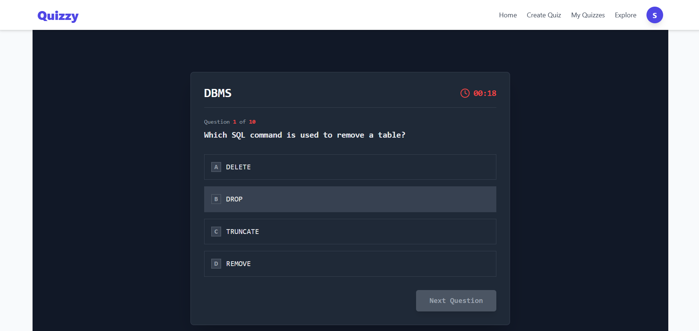
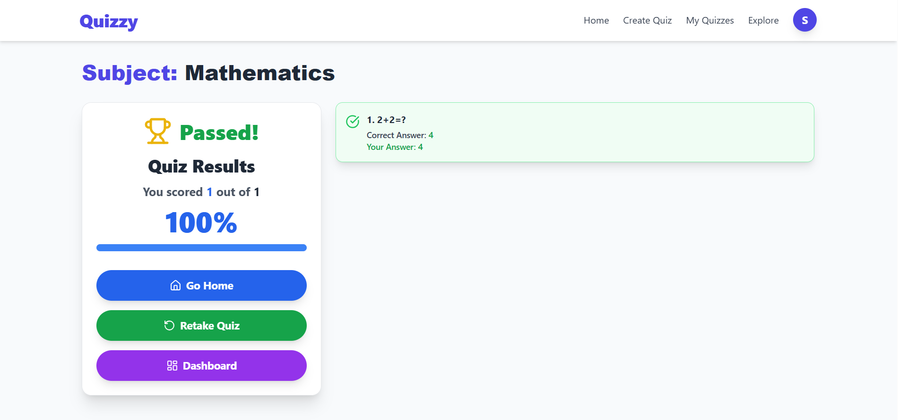
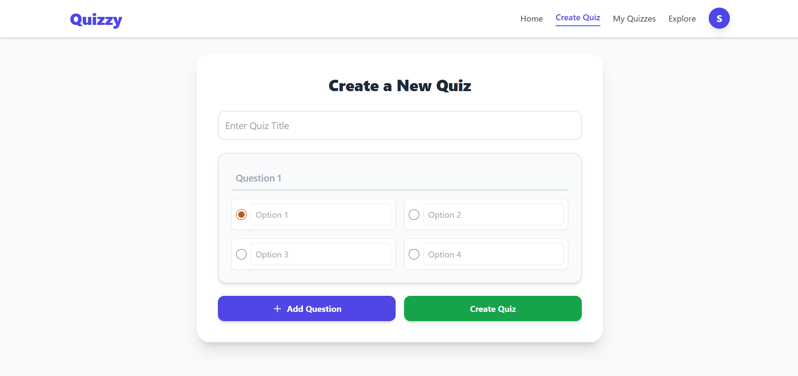

# Quizzy

A secure, interactive **Quizzy** application built with the **MERN stack** (MongoDB, Express.js, React, Node.js). It allows users to take subject-wise quizzes, track their scores, and ensures fair play with anti-cheating measures like full-screen enforcement, tab-switch detection, and developer tools prevention.

## 🚀 Live Demo
[🔗 Try it here](https://online-quiz-maker-np09.onrender.com/)


## 📸 Screenshots

### 1. Quizzy Landing Page



### 3. Quizzy Test Page


### 4. Quizzy Feedback and Result


### 5. Quizzy Create Quiz



## 🚀 Features

- **📚 Subject-wise Quizzes** – Choose from multiple categories (MERN, Java, Web Development, etc.).
- **🏆 Score Tracking** – View real-time results after each quiz.
- **🔒 Security Measures** – Prevent cheating with:
  - Full-screen mode enforcement
  - Tab switch detection
  - Right-click & copy prevention
  - DevTools detection & blocking
- **🖥 Responsive Design** – Works seamlessly on desktop & mobile.
- **⚡ Fast & Smooth** – Powered by the MERN stack for optimal performance.

---

## 🛠 Tech Stack

- **Frontend**: React.js, Vite, Tailwind CSS  
- **Backend**: Node.js, Express.js  
- **Database**: MongoDB  
- **Icons**: Lucide React for consistent iconography  
- **Styling**: Tailwind CSS  
- **Charts**: Recharts for interactive data visualization  
- **Authentication**: JWT authentication for secure access  
- **Security**: Secure API endpoints — only Admin can create quizzes  

### **User Features**
- Dashboard with chart-wise progress tracking  
- Quiz filtering based on category, difficulty, or subject  
- Real-time score updates  

### **Admin Features**
- Create and manage quizzes  


---

## 🏗️ Architecture

The project follows **Atomic Design Principles** for the frontend and a **Modular MVC Pattern** for the backend, ensuring scalability, maintainability, and clear separation of concerns.

---

### **Frontend (Vite + React + TypeScript)**

```
client/
├── public/                  # Static assets (icons, images, etc.)
├── src/
│   ├── api/                  # API request logic
│   │   └── api.ts
│   ├── components/           # Reusable UI components (Atoms, Molecules, Organisms)
│   │   ├── ErrorDisplay.tsx
│   │   ├── Footer.tsx
│   │   ├── Navbar.tsx
│   │   ├── ResultChart.tsx
│   │   └── SuccessDisplay.tsx
│   ├── context/              # Global state providers
│   │   ├── authContext.tsx
│   │   ├── ErrorContext.tsx
│   │   └── SuccessContext.tsx
│   └── pages/                # Application pages (Templates)
│       ├── AuthPage.tsx
│       ├── CreateQuiz.tsx
│       ├── Explore.tsx
│       ├── Home.tsx
│       ├── QuizList.tsx
│       ├── Result.tsx
│       ├── TakeQuiz.tsx
│       └── UserDashboard.tsx
```

---

### **Backend (Node.js + Express + MongoDB + TypeScript)**

```
server/
└── src/
    ├── config/                # Database & environment setup
    │   └── db.ts
    ├── controllers/           # Business logic for API endpoints
    │   ├── authController.ts
    │   ├── quizController.ts
    │   └── userController.ts
    ├── middleware/            # Request handling middlewares
    │   └── authMiddleware.ts
    ├── models/                 # Mongoose schemas
    │   ├── Quiz.ts
    │   ├── Result.ts
    │   └── User.ts
    ├── routes/                 # API endpoint definitions
    │   ├── authRoutes.ts
    │   └── quizzes.ts
    ├── utils/                   # Helper utilities
    │   └── generateToken.ts
    └── validators/              # Request validation
        └── index.ts
```

---

This structure ensures:

* **Frontend:** A clean separation between UI components, global state, and page-level templates.
* **Backend:** A modular approach with distinct layers for configuration, routing, logic, and data management.

---

---

## 🛠️ Installation & Setup

### **Prerequisites**

* **Node.js**: v18.0 or higher
* **Package Manager**: npm or yarn

---

### **Installation Steps**

#### 1️⃣ Clone the Repository

```bash
git clone https://github.com/tsujit74/online-quiz-maker.git
cd online-quiz-maker
```

---

#### 2️⃣ Install Dependencies

**Backend (Server)**

```bash
cd server
npm install
```

**Frontend (Client)**

```bash
cd ../client
npm install
```

---

#### 3️⃣ Configure Environment Variables

Create a `.env` file in **server** directory:

```env
PORT=4000
MONGO_URI=mongodb://localhost:27017/quizzes
JWT_SECRET=tsujit
```

Create a `.env` file in **client** directory:

```env
VITE_API_BASE=http://localhost:4000
```

> **Note:** In Vite, all environment variables **must** start with `VITE_`.

---

#### 4️⃣ Start the Development Servers

Open **two separate terminals**:

**Terminal 1 – Backend**

```bash
cd server
npm run dev
```

**Terminal 2 – Frontend**

```bash
cd client
npm run dev
```

---

#### 5️⃣ View the Application

Once both servers are running, open:

```
http://localhost:5173
```

---

### **Available Scripts**

**In both `client` and `server` directories:**

* `npm run dev` → Start development server
* `npm run build` → Build for production
* `npm run start` → Start production server
* `npm run lint` → Run ESLint for code quality

---

---

## 📱 Usage

### **Online Quizzy: Features Overview**

Quizzy is a secure and comprehensive platform for creating and taking quizzes, with a strong focus on user experience, analytics, and fair play.

---

### **Performance & Analytics Dashboard**

* **Quiz Results & Feedback** – After completing a quiz, users can view detailed performance reports and feedback.
* **User Dashboard** – Displays progress over time with interactive charts, allowing users to track scores and identify areas for improvement.

---

### **Security & Integrity**

* **Secure Quiz Taking** – Prevents cheating by enforcing full-screen mode, disabling right-click, and blocking DevTools.
* **Code Protection** – Implements measures to prevent code inspection and manipulation.

---

### **Admin Capabilities**

* **Quiz Creation Page** – Secure admin-only interface for creating and managing quizzes.
* **Full Control** – Admins can define quiz structure, content, and difficulty levels.

---

### **User Experience**

* **Responsive Design** – Works seamlessly across desktops, tablets, and mobile devices.
* **Filter-Based Search** – Easily locate quizzes by category, difficulty, or keyword.

---


## 🚀 Deployment

### Production Build

```bash
npm run build
npm run start
```

Here’s a well-formatted **"Future Enhancements"** section you can paste directly into your README file:

---

## 🚀 Future Enhancements

Here are some planned improvements and advanced features for future releases:

1. **User Authentication & Profiles**

   * Allow users to create accounts, log in, and track their quiz history and scores.
   * Enable profile customization with avatars and badges.

2. **Timed Quizzes & Leaderboards**

   * Introduce countdown timers for each quiz.
   * Global and category-wise leaderboards to encourage competition.

3. **Advanced Analytics**

   * Show performance graphs, strengths/weakness analysis, and progress tracking over time.

4. **Custom Quiz Creation**

   * Let users create, edit, and share their own quizzes with the community.

5. **Multimedia Support**

   * Include images, audio, and video in questions to make quizzes more interactive.

6. **Mobile App Version**

   * Develop Android & iOS apps for a better on-the-go quiz experience.

7. **Gamification**

   * Add XP points, achievements, streaks, and levels to keep users engaged.

8. **AI-Powered Question Generation**

   * Use AI to automatically generate new questions and quizzes based on selected topics.

---


---

## 🤝 Contributing

We welcome contributions to make **Quizzy** even better!

1. **Fork the repository**
2. **Create a feature branch**

   ```bash
   git checkout -b feature/amazing-feature
   ```
3. **Commit your changes**

   ```bash
   git commit -m "Add some amazing feature"
   ```
4. **Push to the branch**

   ```bash
   git push origin feature/amazing-feature
   ```
5. **Open a Pull Request** and describe your changes in detail.

---

## 📞 Support

For questions, issues, or contributions, please reach out via:

* **GitHub:** [Kaushlendra Singh](https://github.com/yadavkp)
* **LinkedIn:** [Kaushlendra Singh](https://www.linkedin.com/in/kaushlendra-singh-471829276/)
* **GitHub Issues:** Open an issue in the repository.
* **Documentation:** Check for common solutions before raising new issues.

---

**Thank you for your interest in Quizzy!** Your support and contributions help improve the platform for everyone.

**With Gratitude,**
**Kaushlendra Singh ❤️**

---
